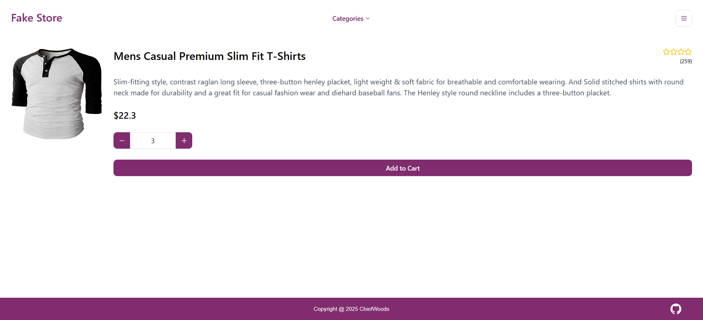

# Shopping Cart



Shopping cart for [The Odin Project](https://www.theodinproject.com/).

[Live Website](https://chiefwoods.github.io/shopping-cart/)

[Source Repository](https://github.com/ChiefWoods/shopping-cart)

## Features

- Browse and add items to cart

## Built With

### Languages

- [](https://react.dev/)

### Bundlers

- [](https://vite.dev/)

### Libraries

- [shadcn/ui](https://ui.shadcn.com/)
- [react-router](https://reactrouter.com/)
- [swr](https://swr.vercel.app/)

## Getting Started

### Prerequisites

Update your Bun toolkit to the latest version.

```bash
bun upgrade
```

### Setup

1. Clone the repository

```bash
git clone https://github.com/ChiefWoods/shopping-cart.git
```

2. Configure env values

```bash
cp .env.example .env.development; cp .env.example .env.production
```

3. Install all dependencies

```bash
bun install
```

4. Start development server

```bash
bun run dev
```

5. Build project

```bash
bun run build
```

6. Preview build

```bash
bun run preview
```

## Issues

View the [open issues](https://github.com/ChiefWoods/shopping-cart/issues) for a full list of proposed features and known bugs.

## Acknowledgements

### Resources

- [Shields.io](https://shields.io/)
- [Lucide](https://lucide.dev/)

### Hosting and API

- [GitHub Pages](https://pages.github.com/)
- [Fake Store API](https://fakestoreapi.com/)

## Contact

[chii.yuen@hotmail.com](mailto:chii.yuen@hotmail.com)
